# VPC setup

1. VPC Page in AWS console, click **Create VPC**

2. In "Resources to create", choose "VPC and more"

3. Name your VPC. e.g. cs5224-project.  Set the number of private subnets  to 4. 

4. Set ”NAT gateways“ as "In 1 AZ". And set "VPC endpoints" to "S3 Gateway"

5. Leave other things as default,and click ”Create VPC“
 
the Resource Map of the VPC should be like this:
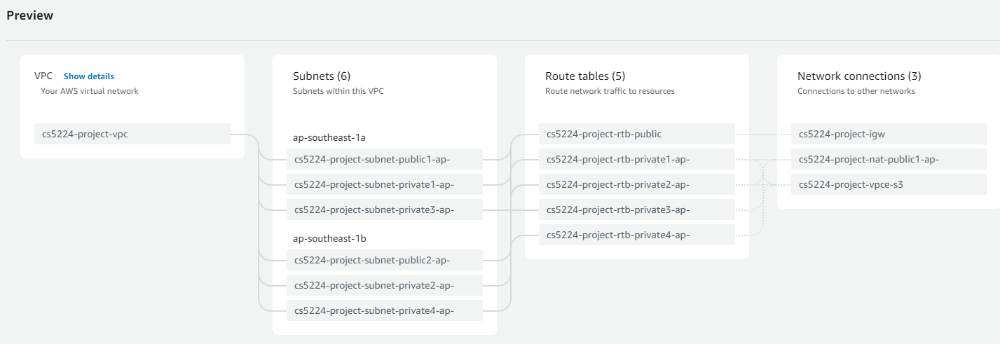

 

# S3 bucket

Create a bucket and name it as "cs5224staticdata". Then upload a the file "tourism_without_geometry.csv" under floder "static_data" to the bucket.


# Deploy Lambda Functions

You need to create 5 lambda functions using code from the three python files in the `lambda functions` folder. They are "cs5224-attraction-id", "cs5224-attraction-search", "cs5224-attractions-get", "cs5224v2_rating_cronjob", "cs5224_table_attractions_filler"


For each Lambda function, add a layer AWSSDKPands:

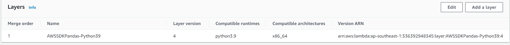


For each Lambda functions, configure its VPC to the VPC you just created,  and choose two private subnets in two different AZs. Configure the Security Group to allow all inbound requests and outbound requests(inboound request limit policy will be configured in API gateway). As the picture below shows:

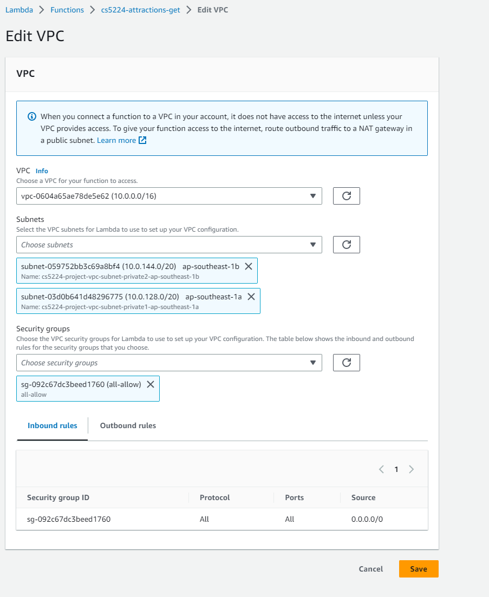 


Add a EventBridge trigger for Lambda function "cs5224v2_rating_cronjob" . So that it runs once a day. Configure it as the picture below shows:

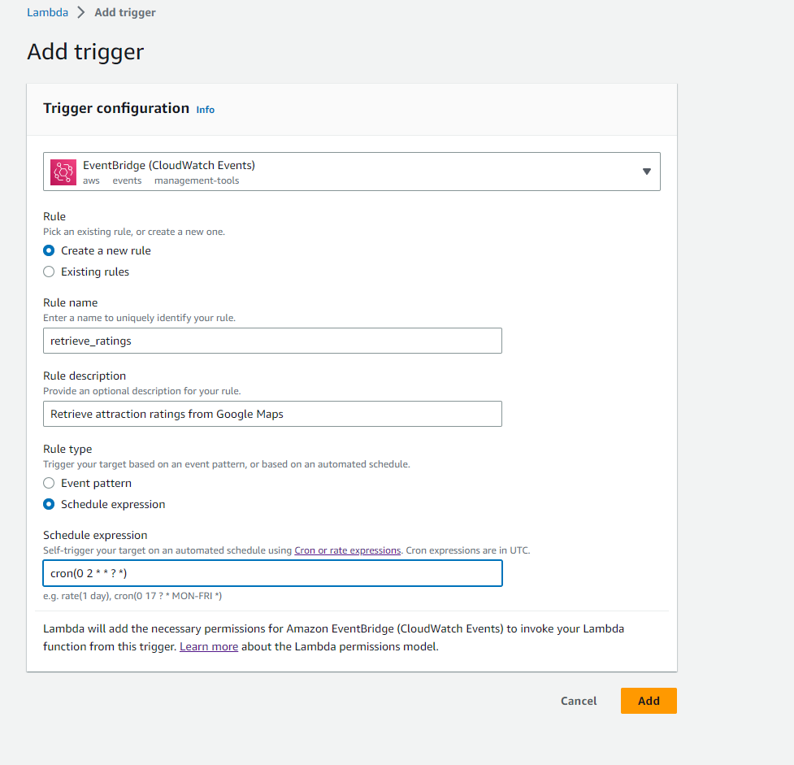

cron(0 2 * * ? *) means it runs at 2:00 am each day.


# RDS

Creat a MySQL RDS.  And deploy it in a private subnet of your VPC.

Use an EC2 to to connect to the RDS, create a database named "cs5224_formal". Then creat tables and a view by these SQL commands:

```sql
CREATE TABLE attractions (
  id INT AUTO_INCREMENT PRIMARY KEY,
  name VARCHAR(255) NOT NULL,
  address VARCHAR(255),
  latitude FLOAT NOT NULL,
  longitude FLOAT NOT NULL,
  image_path VARCHAR(2048),
  meta_descr VARCHAR(2048),
  opening_hours VARCHAR(2048)
);


CREATE TABLE cs5224_formal.attraction_tweets (
  id INT PRIMARY KEY,
  dt DATE,
  other_names JSON,
  hot_tweets JSON,
  twitter_trending_score FLOAT
);


CREATE TABLE attraction_ratings (
  id INT AUTO_INCREMENT PRIMARY KEY,
  rating FLOAT,
);

CREATE VIEW `attractions_all` AS
SELECT a.*, y.other_names, y.hot_tweets, y.twitter_trending_score, t.rating
FROM attractions a
LEFT JOIN attraction_tweets y ON a.id = y.id
LEFT JOIN attraction_ratings t ON a.id = t.id;


```


# Set API Gateway

In API Gateway, create REST API named "Attraction API"by importing this swagger API definition in file *api_definition.yaml*. 


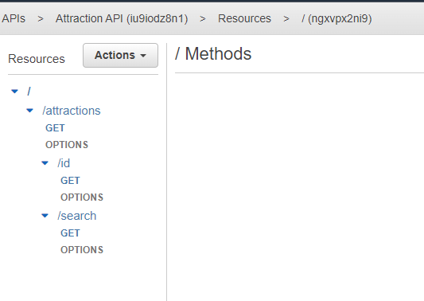


Connect /attractions GET method to Lambda function "cs5224_atttractions_get". 

In "Integration Request". Add mapping template as the picture shows:

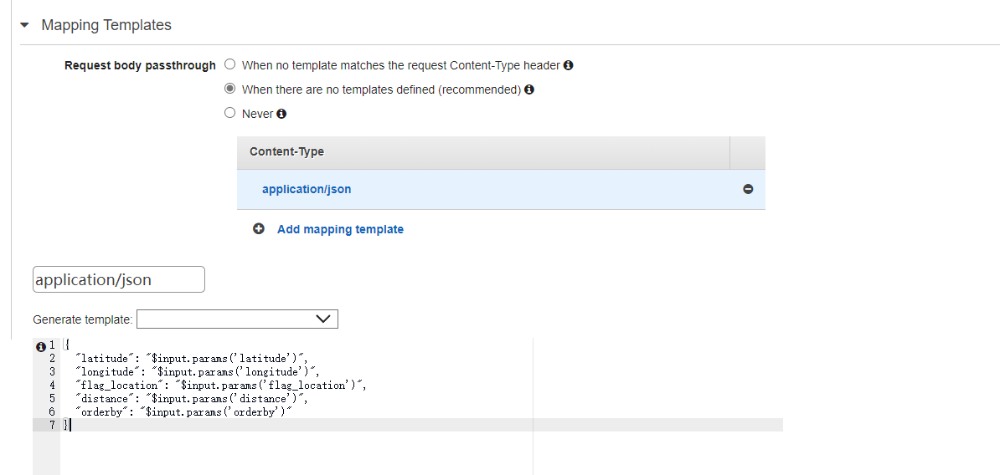


Connect /attractions/id GET method to Lambda function "cs5224_attractions_id". And add Mapping Template in "Integration Request" as the picture shows:

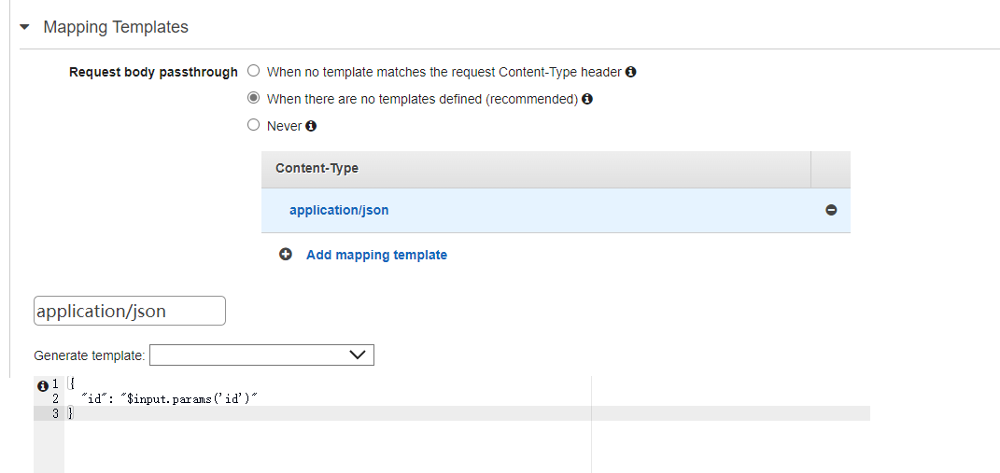

Connect /attractions/search GET method to Lambda function "cs5224_attractions_search". And add Mapping Template in "Integration Request" as the picture shows:

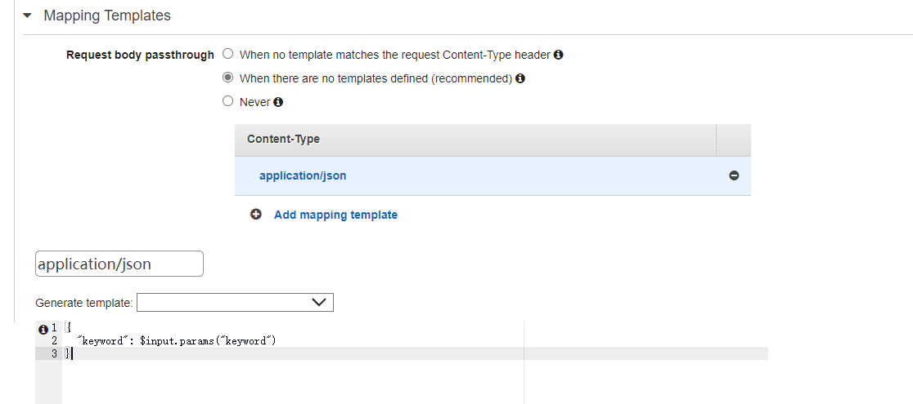


Create a stage for this API


In Resource Policy, configure the access control of your API to **deny any request from outside this VPC**.

e.g.

```JSON
{
    "Version": "2012-10-17",
    "Statement": [
        {
            "Effect": "Allow",
            "Principal": "*",
            "Action": "execute-api:Invoke",
            "Resource": "execute-api:/*/*/*",
            "Condition": {
                "StringEquals": {
                    "aws:sourceVpc": "{VPC-ID}"
                }
            }
        },
        {
            "Effect": "Deny",
            "Principal": "*",
            "Action": "execute-api:Invoke",
            "Resource": "execute-api:/*/*/*",
            "Condition": {
                "StringNotEquals": {
                    "aws:sourceVpc": "{VPC-ID}"
                }
            }
        }
    ]
}


```

Please replace {VPC-ID} with your own VPC ID


# TEST Backend

**Before testing, please run Lambda function "cs5224_table_attractions_filler"  and "cs5224v2_rating_cronjob" first**

Test /attractions GET Method:

https://iu9iodz8n1.execute-api.ap-southeast-1.amazonaws.com/cs5224_apis/attractions?latitude=1.2838785&longitude=103.85899&flag_location=1&distance=10&orderby=1

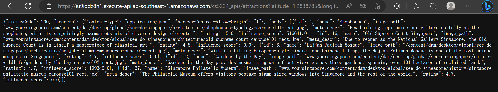


Test /attractions/id GET Method:

 https://iu9iodz8n1.execute-api.ap-southeast-1.amazonaws.com/cs5224_apis/attractions/id?id=100

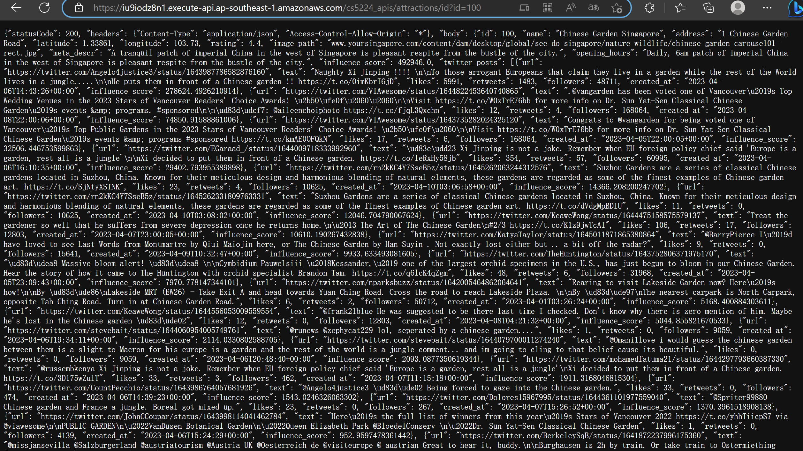

Test /attractions/search Get method:

https://iu9iodz8n1.execute-api.ap-southeast-1.amazonaws.com/cs5224_apis/attractions/search?keyword=Heritage Centre, Singapore

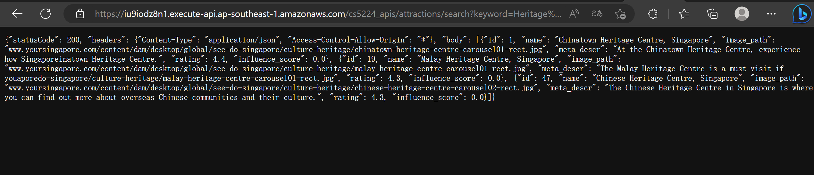

# 

# Front-end Architecture

**Create SSL/TLS Certificate**

First, let’s create an SSL/TLS certificate using AWS Certificate Manager.   We’re going to use sgfavour.example.com as the Common Name for our certificate.

*AWS Management Console*

- Go to https://console.aws.amazon.com/acm/ and follow the steps below.
- Click the Request a Certificate button
- Select Request a public certificate and click Next
- Enter sgfavour.example.com into the Fully qualified domain name field
- Make sure DNS Validation is selected
- Click the Request button

AWS CLI

```
aws acm request-certificate \
      --domain-name sgfavour.example.com \
      --validation-method DNS
```

**Create EC2 Target Group**

Let’s create a target group. A target group is a logical grouping of EC2 instances that can receive traffic from a load balancer.
We’ll create a target group named app-target-group configured for HTTP traffic on port 80 with a health check at /.   And then we will register our EC2 instance into the target group.

*AWS Management Console*

- Go to https://console.aws.amazon.com/ec2/ and follow the steps below.
- Click Target Groups on the left menu 
- Click Create target group
- Make sure the target type of Instances is selected
- In the Target Group Name field, enter app-target-group (Note: you cannot change the name later)
- Change the Port to 80
- Under Health Checks > Health Check Path, make sure the path is /
- Click Next
- Select the EC2 instance from the list of available EC2 instances
- Click the Include as pending below button
- Click the Create Target Group button

*AWS CLI*

The first command creates the target group.  Replace VPC_ID below with your VPC ID.  Copy the target group ARN from the output to use in the next command.

```
aws elbv2 create-target-group \
      --name app-target-group \
      --protocol HTTP \
      --port 80 \
      --target-type instance \
      --vpc-id VPC_ID
```

The next command registers our EC2 instance into the target group.   We need the target group ARN and our EC2 instance ID for this command.

```
aws elbv2 register-targets \
    --target-group-arn TARGET_GROUP_ARN \
    --targets Id=INSTANCE_ID
```

**Create Application Load Balancer**

Next, we’ll create the application load balancer that will accept HTTPS traffic on port 443 and forward the requests to our application on port 80.

*AWS Management Console*

- Go to https://console.aws.amazon.com/ec2/ and follow the steps below.
- Click Load Balancers on the left menu 
- Click Create Load Balancer button
- Under Application Load Balancer, click Create
- Enter app-load-balancer as the load balancer name (Note: you cannot change the name later)
- Leave the scheme as Internet-facing which is the default
- Leave the IP address type as IPv4 which is the default
- Under Network mapping, select the VPC that the target group is in.
- Select all the listed availability zones.
- Under Security groups, create a security group which allows HTTPS 443 from the Internet (0.0.0.0/0) and select that one.
- Under Listeners and routing, select HTTPS and port 443 and then select the target group from the dropdown list.
- Under Default SSL certificate, select the certificate we created.
- Click Create load balancer

*AWS CLI*

The first command creates the load balancer and maps it to subnets in our VPC.   Replace the subnet IDs with your own.

```
aws elbv2 create-load-balancer \
    --name app-load-balancer \
    --subnets SUBNET_ID_1 SUBNET_ID_2 SUBNET_ID_3 SUBNET_ID_4 SUBNET_ID_5 SUBNET_ID_6
```

The second command creates the HTTPS listener on port 443 for the load balancer and configures it to use the certificate we created earlier.   We need three ARNs for this command: the load balancer ARN, the certificate ARN, and the target group ARN.

```
aws elbv2 create-listener \
    --load-balancer-arn LOAD_BALANCER_ARN \
    --protocol HTTPS --port 443  \
    --certificates CertificateArn=CERTIFICATE_ARN \
    --default-actions Type=forward,TargetGroupArn=TARGET_GROUP_ARN
```

*Verify Security Group Configuration*
Our security group configuration must adhere to two rules in order for us to get our solution working:

- The EC2 instance must allow traffic to port 80 from the load balancer.
- The load balancer must allow traffic to port 443 from the Internet (0.0.0.0/0).

If the EC2 instance and load balancer are both assigned to the default security group, then the first rule is taken care of.   The second rule is handled in step 9 of Create Application Load Balancer step.
There are many other ways to configure security groups.   You can refer to the AWS documentation [here](https://docs.aws.amazon.com/vpc/latest/userguide/vpc-security-groups.html).


## Twitter Data Processing

We use AWS Lambda to process Twitter data for a list of attractions. The Lambda function retrieves tweets for each attraction, calculates the influence scores of tweets, and computes the trending score for each attraction. The processed data is then inserted into a MySQL database. To ensure our system handles the Twitter API rate limits, we have designed a distributed architecture with multiple Lambda functions working in parallel, scheduled at different time intervals using EventBridge (CloudWatch Events).

To learn more about the Twitter data processing Lambda function, including setup and deployment instructions, visit the [Twitter Data Processing Lambda Function subdirectory](./twitter).


# Front-end Deployment

**Building in EC2**

 - Test it in local machine, make sure everything works fine.
 - run the following code to buid flutter app, get the files locally:
 ```
 flutter build web
 ```

 For this project, you could directly use the folder in CS5224_project/my_awesome_namer/build/web.

 - run the following code to sent the local files to EC2 machine:
 ```
scp -i path/to/public_key -r path/build/web username@ip:/directory/in/EC2/machine
```
For example:

```
scp -i D:\pe\CS5224_LAB02.pem -r E:\flutterproject\project_20230328\CS5224_frondend\my_awesome_namer\build\web ubuntu@44.193.24.215:/home/ubuntu/web
```

**Deploy it in nginx**
```
sudo apt update
sudo apt install nginx
```
**Configure Nginx**
 - Let’s say your application name is todos so a good folder naming convention would be /var/www/html/todos. Inside the todos directory is the build files, index.html, etc. If you’re not familiar with Linux commands this should help, assuming that your build files are in your home directory.
 - 
```
sudo mv web /var/www/html/todos
```
 - Next, you need to go to the Nginx directory on your server more precisely /etc/nginx/sites-enabled. There should be a file named default. Open it using a vim/nano text editor of your choice and change the root directory on the configuration file to /var/www/html/todos.

```
# Default server configuration
server {
       listen 80 default_server;
       listen [::]:80 default_server;

       root /var/www/html/todos;
       index index.html index.htm;

       server_name _;

       location / {
              try_files $uri $uri/ =404;
       }
}
```
Here is an example. The original file should be filled with comments, but I left those comments out in the gist. After changing your config files, check your Nginx config using this command:
```
sudo nginx -t
```
 - If all is well, then restart the Nginx service:

```
sudo systemctl reload nginx
```
This should restart your Nginx server and get the updated config file. When all is done open up your VPS IP Address from the browser. Your Flutter app should already be up.

*Testing*
If you just want to test the front-end code,  go to the CS5224_project/my_awesome_namer/build/web and under this folder, type:
```
sudo python3 -m http.server 8000
```
It could start like the picture below.
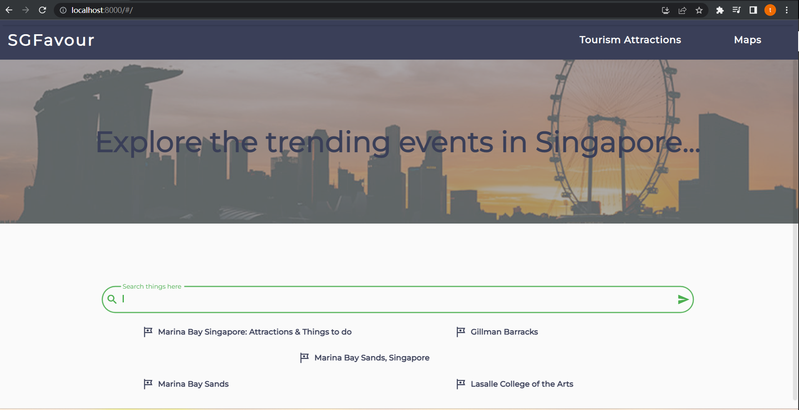
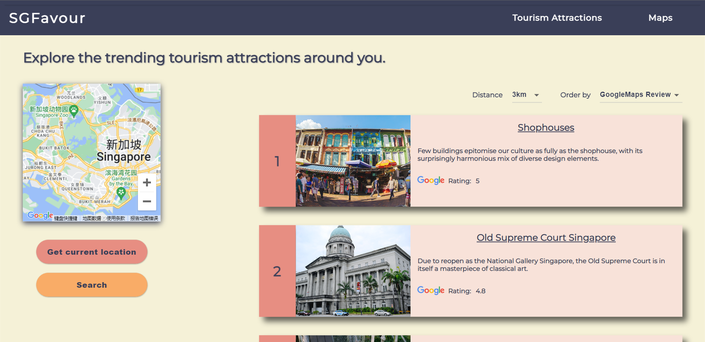
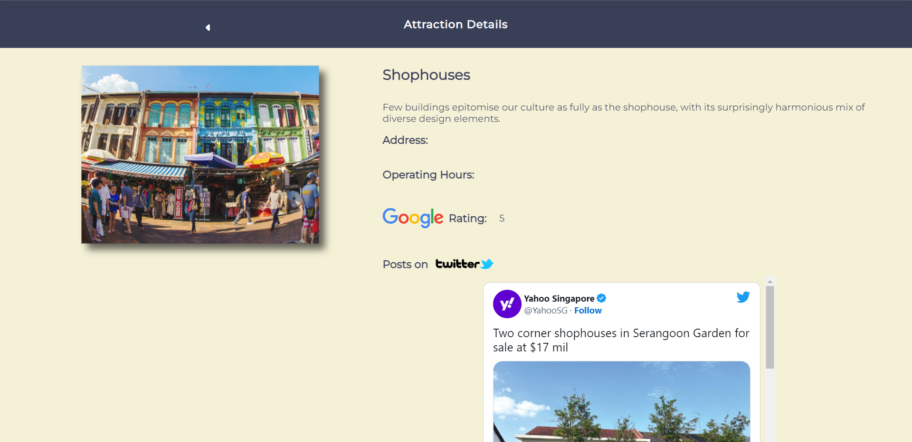

#

